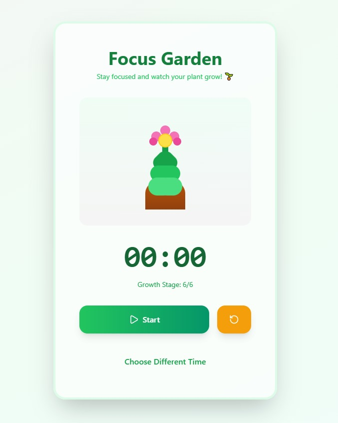

# 🌱 Focus Garden


> A cute and aesthetic focus timer that helps you stay productive while watching your adorable plant grow! 🌸

## ✨ What is Focus Garden?

Focus Garden is a delightful productivity app that combines the power of focused work sessions with the joy of nurturing a virtual plant. As you stay focused and work, your cute little plant grows from a tiny seed into a beautiful blooming flower! 

Perfect for students, remote workers, or anyone who wants to make productivity more fun and rewarding! 💚

## 🎨 Features

- **🌿 Adorable Growing Plant** - Watch your plant evolve through 7 cute stages as you focus
- **⏱️ Flexible Timer Options** - Choose from 10 minutes, 30 minutes, or 1 hour sessions
- **🎨 Beautiful Pastel Design** - Soft, calming colors that are easy on the eyes
- **🌸 Smooth Animations** - Satisfying growth transitions that feel alive
- **⏯️ Simple Controls** - Start, pause, and reset with easy-to-use buttons
- **📊 Progress Tracking** - See your current growth stage at a glance

## 🌳 How Your Plant Grows

### 🕐 3-Minute Session
Perfect for
- Quick tasks
- Short breaks between longer sessions
- When you just need a tiny productivity boost! ✨

### 🕐 10-Minutes Session
Your plant grows faster for quick focus bursts:
- 🌰 **Seed** (Start)
- 🌱 **Sprout** (1 minute)
- 🌿 **Small Plant** (2 minutes)
- 🪴 **Growing** (3 minutes)
- 🌾 **Mature** (6 minutes)
- 🌺 **Flowering** (9 minutes)
- 🌸 **Full Bloom** (10 minutes)

### 🕐 30-Minutes Session
Perfect for deeper focus:
- Growth stage every **5 minutes**

### 🕐 60-Minutes Session
For maximum productivity:
- Growth stage every **10 minutes**

## 🚀 Getting Started

### Prerequisites
- Node.js (v14 or higher)
- npm or yarn

### Installation

1. **Clone or download this adorable project:**
```bash
cd your-project-folder
```

2. **Install dependencies:**
```bash
npm install
```

3. **Start the app:**
```bash
npm start
```

4. **Open your browser and visit:**
```
http://localhost:3000
```

5. **Start focusing and watch your plant grow!** 🌱✨

## 🎮 How to Use

1. **Choose Your Focus Time** - Pick 10 min, 30 min, or 1 hour
2. **Hit Start** - Begin your focus session and watch the timer count down
3. **Stay Focused** - Your plant will grow gradually as time passes!
4. **Pause If Needed** - Life happens, pause and resume anytime
5. **Reset Anytime** - Start fresh with the reset button
6. **Enjoy Your Blooming Plant** - Feel proud when it reaches full bloom! 🌸

## 🛠️ Technologies Used

- **React** - For building the adorable UI
- **Tailwind CSS** - For the beautiful pastel styling
- **Lucide React** - For cute icons
- **Pure CSS** - For smooth plant animations

## 💖 Why Focus Garden?

Because productivity doesn't have to be boring! Focus Garden makes working fun by:
- Giving you a **visual reward** for staying focused
- Creating a **calming environment** with soft colors
- Making time feel less stressful with a **cute companion**
- Turning work sessions into a **little game**

## 🎨 Customization Ideas

Want to make it even cuter? Try:
- Adding sound effects when the plant grows
- Creating different plant types (cactus, sunflower, tree!)
- Adding a garden view to see all your grown plants
- Implementing a streak counter
- Adding rain or sunshine animations

## 🐛 Known Issues

None! This app is as cute and bug-free as possible! 🌸

But if you find any issues, they're probably just butterflies visiting your plant! 🦋

## 📝 License

This project is open source and available under the MIT License. Feel free to use it, modify it, and share it with other cute people who love productivity! 💚

## 🌟 Credits

Made with 💚 by someone cute (that's you!)

Special thanks to:
- Claude for helping bring this adorable idea to life
- All the plants that inspired this design 🌱
- You, for being amazing and productive! ✨

---

### 💌 Final Note

Remember: You're doing great! Every time you use Focus Garden, you're not just being productive - you're nurturing yourself and your goals. Keep growing, you cute productive bean! 🌱💚

**Now go bloom!** 🌸✨

---

*Made by Melis with love, focus, and lots of plant emojis* 🌿💚🌸